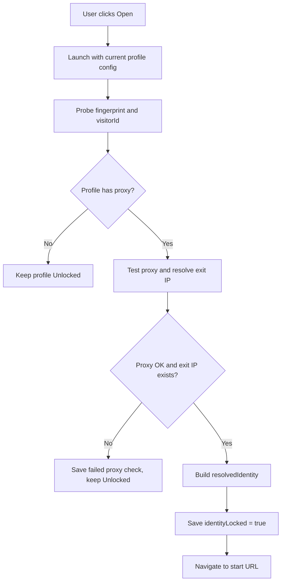
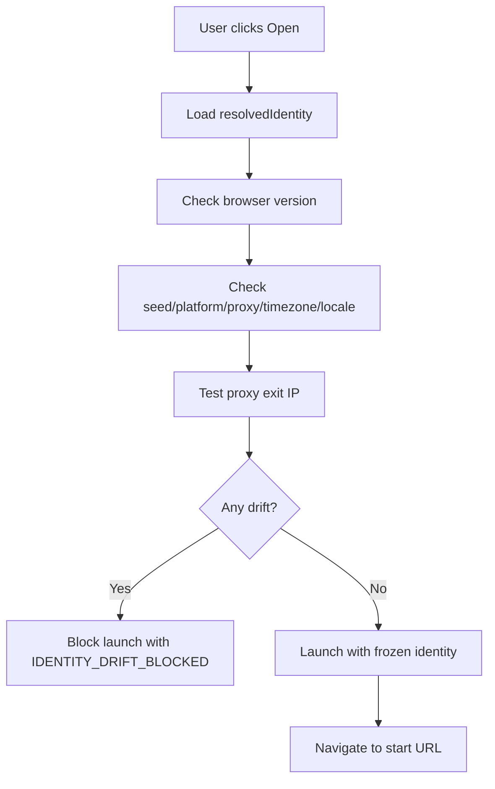

# Hướng Dẫn P0: Stable Identity Lock

Tài liệu này mô tả các chức năng P0 đã được triển khai để giữ fingerprint ổn định cho nhiều profile chạy trên cùng một thiết bị cứng. Mục tiêu chính là: sau khi một profile đã được thiết lập với proxy, app sẽ khóa lại danh tính trình duyệt thực tế của profile đó và chặn các lần mở sau nếu phát hiện môi trường đã bị lệch.

## Chức Năng Đã Triển Khai

### 1. Tự động khóa identity sau lần mở đầu tiên có proxy hợp lệ

Khi một profile chưa khóa identity được mở lần đầu với proxy:

- App mở CloakBrowser với cấu hình hiện tại.
- App đo fingerprint runtime.
- App test proxy để lấy actual exit IP.
- Nếu proxy test thành công và có exit IP, app lưu `resolvedIdentity`.
- Profile được đánh dấu `identityLocked = true`.
- Từ lần mở sau, profile dùng lại identity đã khóa thay vì để GeoIP tự resolve động.

Các dữ liệu được lưu trong `resolvedIdentity`:

- Phiên bản CloakBrowser/Chromium đang dùng.
- Seed fingerprint.
- Platform fingerprint (`windows` hoặc `macos`).
- Proxy đã dùng khi khóa.
- Actual exit IP.
- Country/timezone proxy nếu resolve được.
- Timezone và locale đã áp dụng.
- WebRTC IP đã freeze.
- Fingerprint snapshot.
- FingerprintJS visitor ID nếu đo được.

### 2. Tắt auto-update CloakBrowser binary

App set:

```ts
process.env.CLOAKBROWSER_AUTO_UPDATE = 'false';
```

Việc này tránh trường hợp CloakBrowser tự tải binary mới ở background và làm seed cũ sinh ra fingerprint khác ở lần mở sau. Với profile đã khóa, browser binary version được coi là một phần của identity.

### 3. Launch profile đã khóa bằng cấu hình frozen

Khi profile đã `identityLocked`, app launch bằng dữ liệu trong `resolvedIdentity`:

- `geoip: false`
- `timezone` lấy từ identity đã khóa.
- `locale` lấy từ identity đã khóa.
- `--fingerprint` dùng seed đã khóa.
- `--fingerprint-platform` dùng platform đã khóa.
- `--fingerprint-webrtc-ip` dùng WebRTC IP hoặc exit IP đã khóa.
- Proxy dùng proxy đã khóa.

Điều này giúp profile không tự đổi timezone/locale/WebRTC IP nếu proxy provider trả exit IP khác hoặc GeoIP resolve khác.

### 4. Preflight check trước khi mở profile đã khóa

Trước khi mở profile đã khóa, app kiểm tra các điểm sau:

- Phiên bản CloakBrowser hiện tại có trùng phiên bản đã khóa không.
- Seed hiện tại có trùng seed đã khóa không.
- Platform hiện tại có trùng platform đã khóa không.
- Proxy hiện tại có trùng proxy đã khóa không.
- Timezone và locale có trùng identity đã khóa không.
- Actual exit IP hiện tại của proxy có trùng exit IP đã khóa không.

Nếu có điểm lệch, launch bị chặn bằng lỗi `IDENTITY_DRIFT_BLOCKED`.

### 5. Reset identity

Profile đã khóa không được đổi proxy, platform, timezone, locale hoặc seed trực tiếp. Nếu cần thiết lập lại danh tính:

- Dừng profile nếu đang chạy.
- Bấm `Reset identity`.
- App xóa identity lock và fingerprint snapshot.
- Cookie/session trong `userDataDir` vẫn được giữ.
- Lần mở kế tiếp với proxy hợp lệ sẽ tạo identity lock mới.

### 6. Cảnh báo liên kết proxy nâng cao

App hiện cảnh báo:

- Không có proxy: high risk.
- Nhiều profile đã khóa dùng cùng actual exit IP: high risk.
- Profile đã khóa nhưng proxy check gần nhất trả exit IP khác exit IP đã khóa: high risk.
- Nhiều profile trùng proxy host/port: medium risk.
- Nhiều profile đã khóa cùng ASN/ISP và cùng vị trí proxy: medium risk.

### 7. UI trạng thái identity

Mỗi profile có badge:

- `Unlocked`: profile chưa khóa identity.
- `Locked`: profile đã khóa identity.
- `Drift`: profile đã khóa nhưng có dấu hiệu lệch identity, ví dụ proxy exit IP mới khác IP đã khóa.

Khi profile được khóa lần đầu, app hiện toast:

```text
Identity locked for this profile.
```

Nếu launch bị chặn vì drift, app hiện dialog `Identity drift blocked` và cho phép reset identity.

## Cách Sử Dụng

### Tạo profile mới đúng quy trình

1. Bấm `+ Tạo profile`.
2. Nhập tên profile.
3. Bật `Dùng proxy`.
4. Nhập proxy sticky riêng cho profile đó.
5. Bật `geoip` trong lần setup đầu tiên nếu muốn app tự khớp timezone/ngôn ngữ theo IP.
6. Bấm `Test proxy` để kiểm tra proxy.
7. Lưu profile.
8. Bấm `Mở`.
9. Nếu proxy hoạt động và app đo fingerprint được, profile sẽ tự chuyển sang `Locked`.

Sau bước này, không nên đổi proxy hoặc fingerprint của profile nữa.

### Mở lại profile đã khóa

1. Bấm `Mở`.
2. App chạy preflight check.
3. Nếu mọi thứ khớp, profile mở bình thường.
4. Nếu proxy exit IP, browser version hoặc identity config bị lệch, app sẽ chặn launch.

### Khi bị chặn vì identity drift

Ví dụ lỗi:

```text
Identity drift blocked: exitIp
```

Ý nghĩa: profile đã khóa với một exit IP, nhưng proxy hiện tại trả exit IP khác.

Cách xử lý khuyến nghị:

1. Kiểm tra lại proxy provider.
2. Nếu proxy chỉ tạm lỗi, chờ proxy quay về đúng sticky IP rồi mở lại.
3. Nếu bạn muốn đổi sang proxy/danh tính mới, bấm `Reset identity`.
4. Mở profile lại để khóa identity mới.

Không nên reset identity nếu tài khoản đã đăng nhập và đang hoạt động ổn trên nền tảng, vì nền tảng có thể nhìn thấy đây là thay đổi thiết bị/môi trường.

### Đổi seed/fingerprint

Với profile chưa khóa:

- Có thể dùng `Đổi seed`.
- Lần mở tiếp theo app sẽ đo fingerprint mới.

Với profile đã khóa:

- Không thể đổi seed trực tiếp.
- Phải `Reset identity` trước.

## Cách Hoạt Động Bên Trong

### Luồng profile chưa khóa



### Luồng profile đã khóa



### Vì sao không dùng GeoIP động sau khi khóa?

GeoIP động phù hợp cho lần setup đầu tiên, vì app cần biết proxy đang ở timezone/locale nào. Nhưng sau khi profile đã sử dụng trên nền tảng, việc tự resolve lại mỗi lần mở có thể làm thay đổi:

- Timezone.
- Locale.
- WebRTC IP.
- Geolocation-related signals.

Vì vậy profile đã khóa luôn dùng giá trị đã lưu trong `resolvedIdentity`.

### Vì sao actual exit IP quan trọng hơn proxy host?

Nhiều proxy provider có thể dùng nhiều endpoint khác nhau nhưng vẫn trỏ ra cùng một exit IP, hoặc cùng một pool mạng. Vì vậy app không chỉ kiểm tra `host:port`; app còn lưu và so sánh actual exit IP.

## Các File Chính Đã Thay Đổi

- `src/main/types.ts`: thêm `ResolvedIdentity`, `ProxyCheckSnapshot`, `LaunchResult`, drift types.
- `src/main/store.ts`: migration schema, lock/reset identity, chặn sửa field nhạy cảm khi locked.
- `src/main/identity-service.ts`: preflight, drift detection, proxy snapshot, build resolved identity.
- `src/main/launch-args.ts`: launch profile locked bằng frozen identity.
- `src/main/browser-manager.ts`: auto-lock sau lần launch đầu có proxy hợp lệ.
- `src/main/proxy-tester.ts`: resolve actual exit IP và metadata IP.
- `src/main/unlinkability.ts`: cảnh báo trùng exit IP và drift.
- `src/main/ipc.ts`: thêm `profiles:reset-identity`, `profiles:preflight-identity`, launch result.
- `src/preload/preload.ts`: expose API mới.
- `src/renderer/App.tsx`: xử lý toast lock, dialog drift, reset identity.
- `src/renderer/components/ProfileForm.tsx`: disable field identity-impacting khi locked.
- `src/renderer/components/ProfileList.tsx`: hiển thị badge `Unlocked` / `Locked` / `Drift`.

## Kiểm Thử Đã Thêm

Các test mới hoặc đã cập nhật bao phủ:

- Store migration backfill field identity mới.
- Profile locked không được sửa proxy/platform/timezone/locale/geoip.
- Profile locked không được regenerate seed.
- Reset identity xóa lock/snapshot nhưng giữ profile data.
- Locked launch args dùng `geoip:false`, timezone/locale frozen và WebRTC IP fixed.
- Proxy tester trả `exitIp` và metadata best-effort.
- Warning phát hiện trùng actual exit IP giữa locked profiles.
- IdentityService pass preflight khi identity khớp.
- IdentityService block drift ở browser version, proxy exit IP, seed, platform, timezone, locale.
- BrowserManager tự lock identity sau lần mở đầu tiên có proxy hợp lệ.

Lệnh đã chạy:

```bash
npm test -- --exclude tests/integration/anti-detect.test.ts
npm run build
```

Kết quả:

- 9 test files passed.
- 50 tests passed.
- Production build passed.

## Giới Hạn Hiện Tại

- Chưa thêm các advanced fingerprint option kiểu BitBrowser như canvas/audio/fonts/media devices/custom GPU list.
- Chưa chuyển external FingerprintJS probe sang diagnostic-only mode.
- Chưa kiểm tra DNS leak thật sự.
- Metadata IP từ `ipwho.is` là best-effort; nếu service fail, app vẫn có thể lock bằng actual exit IP nếu `api.ipify.org` trả IP thành công.
- Locked identity yêu cầu proxy sticky. Proxy rotating có thể bị block nếu exit IP đổi.

## Khuyến Nghị Vận Hành

- Mỗi profile nên dùng một sticky residential/ISP proxy riêng.
- Không dùng cùng proxy exit IP cho nhiều profile trên cùng một nền tảng.
- Không reset identity nếu account đã login và đang hoạt động ổn.
- Không update browser binary cho profile đã khóa nếu không có kế hoạch migrate identity.
- Sau khi tạo profile, nên mở trang kiểm tra fingerprint thủ công nếu cần xác nhận sâu hơn.

